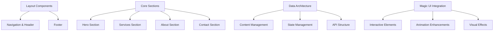

# CodeFlick Phase 2: Core Component Implementation
**🎯 Building on the Solid Foundation of Phase 1**

---

## 🏗️ Phase 2 Overview

**Objective**: Transform the established foundation into a living, interactive application by implementing core components, data architecture, and Magic UI integrations.

**Duration**: 3-5 days  
**Complexity**: Moderate to High  
**Primary Focus**: Component architecture, data flow, and user interactions

---

## 📊 Phase 2 Architecture Strategy

### **1. Component Implementation Hierarchy**



### **2. Implementation Phases**

**Phase 2A**: Foundation Components (Days 1-2)
- Navigation system with mobile responsiveness
- Hero section with Magic UI integration
- Data architecture establishment

**Phase 2B**: Content Sections (Days 2-3)
- Services section with animated cards
- About section with interactive elements
- Contact form with validation

**Phase 2C**: Enhancement & Optimization (Days 4-5)
- Magic UI integration refinement
- Performance optimization
- Accessibility validation

---

## 🎨 Component Architecture Design

### **Navigation System**

**File**: `src/components/sections/Navigation.tsx`

**Features**:
- Fixed header with scroll-based styling
- Mobile hamburger menu with animations
- Active section highlighting
- CTA button integration

**Magic UI Integrations**:
- `ShimmerButton` for CTA
- `BorderBeam` for active states
- `BlurFade` for mobile menu transitions

**Technical Specifications**:
```typescript
interface NavigationProps {
  transparent?: boolean;
  sticky?: boolean;
  mobileBreakpoint?: 'sm' | 'md' | 'lg';
}

interface NavigationState {
  isScrolled: boolean;
  activeSection: string;
  mobileMenuOpen: boolean;
}
```

### **Hero Section Architecture**

**File**: `src/components/sections/HeroSection.tsx`

**Features**:
- Dynamic text animations
- Statistics counter
- Interactive background elements
- Responsive call-to-action

**Magic UI Integrations**:
- `AnimatedGradientText` for title highlight
- `NumberTicker` for statistics
- `ShimmerButton` for primary CTA
- `RippleButton` for secondary CTA
- `Meteors` for background animation
- `AnimatedGridPattern` for subtle texture

**Data Integration**:
```typescript
interface HeroData {
  badge: {
    text: string;
    icon?: string;
  };
  title: {
    main: string;
    highlight: string;
  };
  description: string;
  cta: {
    primary: { text: string; href: string; };
    secondary: { text: string; href: string; };
  };
  stats: Array<{
    value: number;
    suffix: string;
    label: string;
    icon?: string;
  }>;
  background: {
    enableMeteors: boolean;
    enableGrid: boolean;
    gradientOverlay: string;
  };
}
```

### **Services Section Design**

**File**: `src/components/sections/ServicesSection.tsx`

**Features**:
- Grid layout with responsive cards
- Hover effects and animations
- Technology stack display
- Pricing information

**Magic UI Integrations**:
- `MagicCard` for service cards
- `AnimatedBeam` for connections
- `IconCloud` for technology display
- `PulsatingButton` for "Learn More" actions
- `AnimatedList` for features

**Component Structure**:
```typescript
interface Service {
  id: string;
  title: string;
  description: string;
  icon: React.ReactNode;
  features: string[];
  technologies: string[];
  pricing: {
    starting: number;
    type: 'fixed' | 'hourly' | 'project';
    currency: string;
  };
  highlighted?: boolean;
}
```

---

## 📊 Data Architecture Implementation

### **1. Content Management System**

**Directory**: `src/data/`

**Files Structure**:
```
src/data/
├── index.ts              # Data exports
├── heroData.ts          # Hero section content
├── navigationData.ts    # Navigation menu items
├── servicesData.ts      # Services information
├── aboutData.ts         # About section content
├── contactData.ts       # Contact form configuration
├── projectsData.ts      # Portfolio projects
└── testimonialData.ts   # Client testimonials
```

**Central Data Export**:
```typescript
// src/data/index.ts
export { heroData } from './heroData';
export { navigationData } from './navigationData';
export { servicesData } from './servicesData';
export { aboutData } from './aboutData';
export { contactData } from './contactData';
export { projectsData } from './projectsData';
export { testimonialData } from './testimonialData';

export type {
  HeroData,
  NavigationData,
  Service,
  AboutData,
  ContactData,
  Project,
  Testimonial
} from './types';
```

### **2. Type System Enhancement**

**File**: `src/lib/types.ts`

**Enhanced Type Definitions**:
```typescript
// Base types
export interface BaseComponent {
  id: string;
  visible: boolean;
  order: number;
}

// Animation types
export interface AnimationConfig {
  type: 'fadeIn' | 'slideIn' | 'scaleIn' | 'custom';
  duration: number;
  delay: number;
  easing: string;
}

// Magic UI component props
export interface MagicUIProps {
  shimmerButton?: {
    background: string;
    borderRadius: string;
    shimmerColor?: string;
  };
  animatedText?: {
    gradient: string[];
    animationSpeed: number;
  };
  particleConfig?: {
    count: number;
    color: string;
    speed: number;
  };
}

// Contact form types
export interface ContactForm {
  name: string;
  email: string;
  company?: string;
  message: string;
  budget?: 'under-5k' | '5k-15k' | '15k-50k' | 'over-50k';
  timeline?: 'asap' | '1-month' | '2-3-months' | 'flexible';
}

// Form validation
export interface ValidationRules {
  required: boolean;
  minLength?: number;
  maxLength?: number;
  pattern?: RegExp;
  customValidator?: (value: string) => boolean;
}
```

### **3. State Management Strategy**

**Approach**: React Context + useReducer for complex state

**File**: `src/lib/context/AppContext.tsx`

```typescript
interface AppState {
  navigation: {
    activeSection: string;
    mobileMenuOpen: boolean;
  };
  theme: {
    mode: 'light' | 'dark';
    accentColor: string;
  };
  ui: {
    isLoading: boolean;
    notifications: Notification[];
  };
  contact: {
    formData: Partial<ContactForm>;
    isSubmitting: boolean;
    submitStatus: 'idle' | 'success' | 'error';
  };
}
```

---

## ✨ Magic UI Integration Strategy

### **Primary Integration Components**

**1. Hero Section Enhancements**
- `AnimatedGradientText`: Main title highlight
- `NumberTicker`: Statistics animation
- `Meteors`: Background ambiance
- `ShimmerButton`: Primary CTA
- `RippleButton`: Secondary CTA

**2. Services Section Magic**
- `MagicCard`: Service card containers
- `IconCloud`: Technology visualization
- `AnimatedBeam`: Service connections
- `PulsatingButton`: Action buttons

**3. Interactive Elements**
- `BorderBeam`: Active navigation states
- `BlurFade`: Section transitions
- `TextReveal`: Scroll-based text animation
- `ScrollProgress`: Page progress indicator

**4. Background Enhancements**
- `AnimatedGridPattern`: Subtle textures
- `DotPattern`: Section dividers
- `RetroGrid`: Footer background
- `Particles`: Interactive cursor effects

### **Magic UI Configuration System**

**File**: `src/lib/magicui-config.ts`

```typescript
export const magicUIConfig = {
  shimmerButton: {
    primary: {
      background: 'var(--color-primary)',
      borderRadius: '12px',
      shimmerColor: 'rgba(255, 255, 255, 0.3)',
    },
    secondary: {
      background: 'transparent',
      borderRadius: '12px',
      shimmerColor: 'var(--color-primary)',
    },
  },
  
  animatedText: {
    hero: {
      gradient: ['var(--color-primary)', 'var(--color-accent)', 'var(--color-primary)'],
      animationSpeed: 3,
    },
  },
  
  particles: {
    cursor: {
      count: 20,
      color: 'var(--color-primary)',
      speed: 0.5,
    },
  },
  
  grid: {
    hero: {
      spacing: 50,
      color: 'var(--color-primary)',
      opacity: 0.1,
    },
  },
};
```

---

## ♿ Accessibility Implementation Plan

### **1. Keyboard Navigation**

**Focus Management**:
- Proper tab order throughout components
- Skip navigation links
- Focus trap in mobile menu
- Escape key handlers

**Implementation**:
```typescript
// src/hooks/useKeyboardNavigation.ts
export function useKeyboardNavigation() {
  const handleKeyDown = useCallback((event: KeyboardEvent) => {
    switch (event.key) {
      case 'Tab':
        // Tab order management
        break;
      case 'Escape':
        // Close modals/menus
        break;
      case 'Enter':
      case ' ':
        // Activate buttons/links
        break;
    }
  }, []);

  useEffect(() => {
    document.addEventListener('keydown', handleKeyDown);
    return () => document.removeEventListener('keydown', handleKeyDown);
  }, [handleKeyDown]);
}
```

### **2. Screen Reader Support**

**ARIA Implementation**:
- Proper heading hierarchy (h1 → h2 → h3)
- Landmark regions (main, nav, aside, footer)
- Live regions for dynamic content
- Descriptive labels and descriptions

**Components**:
```typescript
// src/components/ui/AccessibleButton.tsx
interface AccessibleButtonProps {
  children: React.ReactNode;
  ariaLabel?: string;
  ariaDescribedBy?: string;
  isLoading?: boolean;
  loadingText?: string;
}
```

### **3. Visual Accessibility**

**Color and Contrast**:
- Minimum 4.5:1 contrast ratio
- Color-independent information
- High contrast mode support
- Focus indicators

**Motion and Animation**:
- Reduced motion support
- Animation disable options
- Pause/play controls for autoplay content

---

## 🚀 Performance Optimization Strategy

### **1. Code Splitting and Lazy Loading**

**Component-Based Splitting**:
```typescript
// src/app/page.tsx
import { lazy, Suspense } from 'react';
import { HeroSection } from '@/components/sections/HeroSection';

const ServicesSection = lazy(() => import('@/components/sections/ServicesSection'));
const AboutSection = lazy(() => import('@/components/sections/AboutSection'));
const ContactSection = lazy(() => import('@/components/sections/ContactSection'));

export default function HomePage() {
  return (
    <>
      <HeroSection />
      <Suspense fallback={<SectionLoader />}>
        <ServicesSection />
      </Suspense>
      <Suspense fallback={<SectionLoader />}>
        <AboutSection />
      </Suspense>
      <Suspense fallback={<SectionLoader />}>
        <ContactSection />
      </Suspense>
    </>
  );
}
```

### **2. Animation Performance**

**GSAP Optimization**:
- Dynamic imports for GSAP plugins
- RAF-based animations
- GPU acceleration via CSS transforms
- Animation cleanup on unmount

**Framer Motion Optimization**:
- LayoutId for shared element transitions
- AnimatePresence for enter/exit animations
- Reduced motion configurations
- Viewport-based animations

### **3. Bundle Optimization**

**Magic UI Selective Imports**:
```typescript
// Instead of importing entire Magic UI
// import * from 'magicui';

// Import only needed components
import { ShimmerButton } from '@/components/magic-ui/shimmer-button';
import { AnimatedGradientText } from '@/components/magic-ui/animated-gradient-text';
import { NumberTicker } from '@/components/magic-ui/number-ticker';
```

---

## 📋 Implementation Timeline

### **Day 1-2: Foundation Components**

**Tasks**:
- [ ] Implement Navigation component with mobile menu
- [ ] Create Hero section with Magic UI integration
- [ ] Establish data architecture and type system
- [ ] Set up context for state management

**Deliverables**:
- Functional navigation system
- Animated hero section
- Data structure established
- Mobile responsiveness tested

### **Day 2-3: Content Sections**

**Tasks**:
- [ ] Build Services section with MagicCard integration
- [ ] Implement About section with interactive elements
- [ ] Create Contact form with validation
- [ ] Add Magic UI animations throughout

**Deliverables**:
- Complete Services showcase
- Interactive About section
- Functional contact form
- Smooth animations

### **Day 4-5: Enhancement & Optimization**

**Tasks**:
- [ ] Refine Magic UI integrations
- [ ] Optimize performance and bundle size
- [ ] Complete accessibility audit
- [ ] Cross-browser testing

**Deliverables**:
- Polished user experience
- Optimized performance
- WCAG 2.1 AA compliance
- Cross-browser compatibility

---

## 🎯 Success Metrics

### **Technical Metrics**
- **Performance**: Lighthouse score 95+ (all categories)
- **Accessibility**: WCAG 2.1 AA compliance (100%)
- **Bundle Size**: <500KB initial load
- **Animation**: 60fps smooth animations

### **User Experience Metrics**
- **Load Time**: <2s on 3G networks
- **Interaction**: <100ms response time
- **Mobile**: Perfect responsive design
- **Navigation**: Intuitive user flow

### **Code Quality Metrics**
- **TypeScript**: 100% type coverage
- **Testing**: >80% component coverage
- **Linting**: Zero ESLint warnings
- **Documentation**: Complete component docs

---

## 🔧 Development Commands

```bash
# Development with performance monitoring
npm run dev:analyze          # Bundle analyzer enabled
npm run dev:lighthouse       # Lighthouse CI integration

# Quality assurance
npm run test:components       # Component testing
npm run test:accessibility    # a11y testing
npm run test:performance      # Performance testing

# Build optimization
npm run build:analyze         # Production bundle analysis
npm run build:preview         # Build and preview locally
```

---

## 📚 Resources and References

### **Documentation**
- [Next.js 15 App Router](https://nextjs.org/docs/app)
- [Tailwind CSS 4 Documentation](https://tailwindcss.com/docs)
- [Framer Motion Guide](https://www.framer.com/motion/)
- [GSAP ScrollTrigger](https://greensock.com/scrolltrigger/)
- [WCAG 2.1 Guidelines](https://www.w3.org/WAI/WCAG21/quickref/)

### **Tools**
- **Design**: Figma, Adobe XD
- **Development**: VS Code, TypeScript
- **Testing**: Jest, Testing Library, Playwright
- **Performance**: Lighthouse, Bundle Analyzer
- **Accessibility**: axe-core, WAVE

---

## 🚀 Ready to Execute

Phase 2 design is comprehensive and ready for implementation. The architecture balances:

- **Performance**: Optimized loading and animations
- **Accessibility**: WCAG 2.1 AA compliance built-in
- **User Experience**: Smooth, intuitive interactions
- **Developer Experience**: Type-safe, maintainable code
- **Scalability**: Modular component architecture

**Next Step**: Execute Phase 2A - Foundation Components implementation.